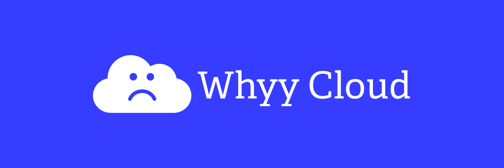
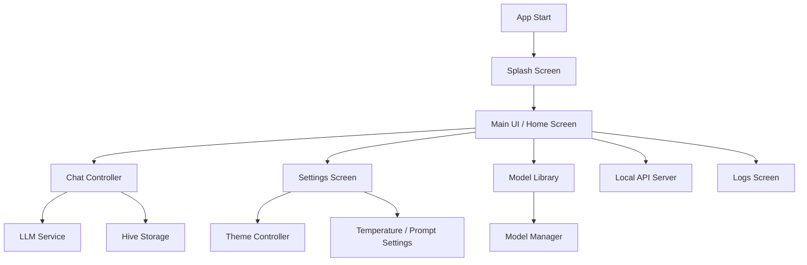

  

Whyy Cloud is a Flutter app for local AI chat workflows across mobile and desktop. Chats, settings, and model metadata stay on the device while the UI coordinates model loading, prompt control, logs, and a local API surface.

## What It Does

- Local chat UI with persistent history.
- Adjustable temperature and system prompt controls.
- Model library and model storage management.
- Local API server support.
- Logs for troubleshooting.
- Light and dark themes.

## App Flow



## Core Structure

- `lib/screens/` UI screens.
- `lib/controllers/` app state and actions.
- `lib/services/` model loading, storage, and API logic.
- `lib/models/` data classes.
- `lib/theme/` colors and theme setup.
- `lib/routes/` navigation.

## Startup

`lib/main.dart` initializes Flutter, Hive, adapters, settings, theme state, and then starts `GetMaterialApp`.

## Build And Run

```bash
flutter pub get
flutter run
flutter run -d emulator-5554
flutter build apk --release
```

On this machine, Android builds work with:

- `ANDROID_HOME=/Users/aditya/Library/Android/sdk`
- `JAVA_HOME=/Applications/Android Studio.app/Contents/jbr/Contents/Home`

## Release Signing

Local release signing uses:

- `android/app/upload-keystore.jks`
- `android/key.properties`

If those files are missing, release builds fall back to debug signing for local development.

## License
Use is limited by [LICENSE](LICENSE). You may study, fork, and improve the app for personal or educational use with attribution preserved, but you may not rebrand or present it as your own independent product.
