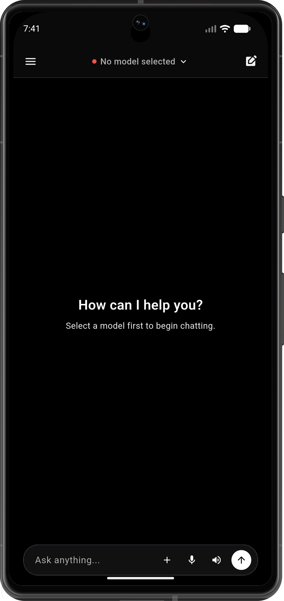
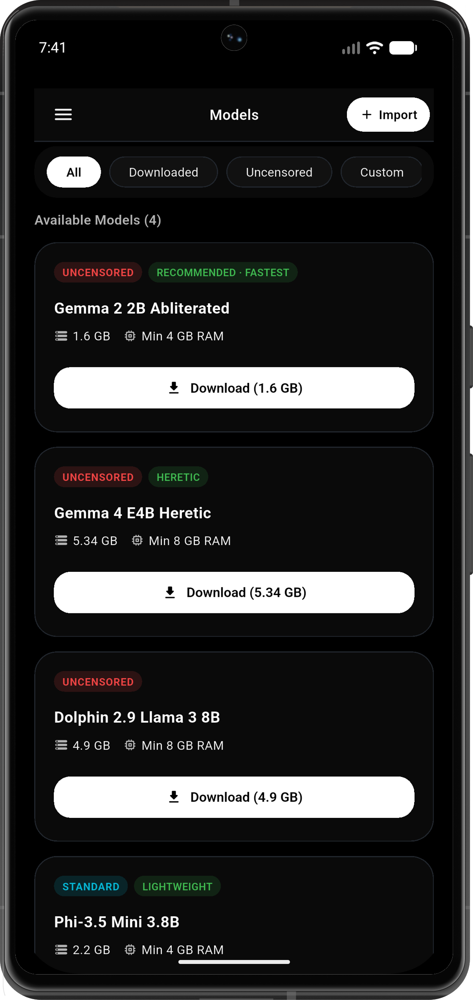
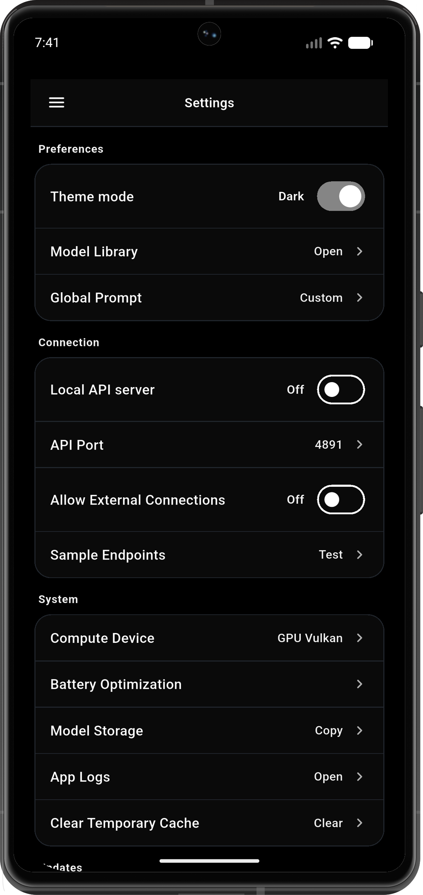

<div align="center">
  
  <p><strong>Portable AI — Run uncensored local LLMs natively on any device.</strong></p>
</div>

<br/>

Whyy Cloud is a comprehensive Flutter application that brings powerful, privacy-first local AI chat workflows directly to your mobile and desktop devices. Every chat, setting, and model remains exclusively on your device. The refined UI coordinates seamless model loading, parameter adjustments, transparent logs, and an integrated local API surface.

## Screenshots

<div align="center">
  
  
  
</div>

## Features

- **Local-First Execution:** 100% on-device inference using `llamadart` + `llama.cpp`. No internet required to chat.
- **Persistent Chat History:** Store and manage conversations securely using Hive local storage.
- **Over-The-Air (OTA) Models:** Download, manage, and run new models directly from the built-in library—no app updates required.
- **Granular AI Controls:** Tweak generation settings like `Temperature`, `System Prompts`, and hardware compute devices (CPU/Vulkan/OpenCL).
- **In-App Updater:** Automatically fetch the latest updates from the GitHub repository and install new APKs directly within the app.
- **Local API Server:** Expose your loaded model to your local network with an OpenAI-compatible API endpoint for easy integration with other tools.
- **Multimodal Support:** Voice inputs (Speech-to-Text), Text-to-Speech (TTS), and image/file attachments for vision models.
- **Customizable UI:** Full dark/light mode support, aesthetic glassmorphism, and dynamic component styling.
- **Deep Troubleshooting:** Built-in logs screen to monitor token generation speed, backend allocations, and diagnostic events.

---

## Architecture & App Flow

The application is structured logically to ensure state management (via GetX) remains decoupled from the UI:

```mermaid
flowchart TD
	A[App Start] --> B[Splash Screen]
	B --> C[Main UI / Home Screen]
	C --> D[Chat Controller]
	D --> E[LLM Service]
	D --> F[Hive Storage]
	C --> G[Settings Screen]
	G --> H[Theme Controller]
	G --> I[Update / App State Settings]
	C --> J[Model Library]
	J --> K[Model Manager (OTA)]
	C --> L[Local API Server]
	C --> M[Logs Screen]
```

### Core Directory Structure

| Directory | Purpose |
| --- | --- |
| `lib/screens/` | Distinct UI screens (Home, Settings, Models, Logs, API) |
| `lib/controllers/` | GetX controllers managing reactive state and business logic |
| `lib/services/` | Heavy lifting: LLM backend bindings, local storage, OTA downloads, WakeLock |
| `lib/models/` | Immutable data classes and Hive type adapters |
| `lib/theme/` | Centralized color palettes, typography, and styling constants |
| `lib/widgets/` | Reusable UI components (Chat Bubbles, Model Cards, Input Bars) |
| `lib/bindings/` | GetX dependency injection setup |

---

## Getting Started

### Prerequisites

Ensure your Flutter environment is correctly set up.
For Android development on this machine, ensure these paths are available:
- `ANDROID_HOME=/Users/aditya/Library/Android/sdk`
- `JAVA_HOME=/Applications/Android Studio.app/Contents/jbr/Contents/Home`

### Build & Run

```bash
# Fetch dependencies
flutter pub get

# Run on the default connected device
flutter run

# Run on a specific emulator
flutter run -d emulator-5554

# Build a production-ready APK
flutter build apk --release
```

---

## Release Signing

Local release signing for Android uses a keystore configuration. The build pipeline looks for:
1. `whyycloud.jks` in the project root.
2. `android/key.properties` defining the keystore passwords and alias (`key0`).

If these files are missing, Gradle will automatically fall back to debug signing for local development.

---

## License

Use is limited by the `LICENSE` file. You may study, fork, and improve the app for personal or educational use with attribution preserved, but you may not rebrand or present it as your own independent product.
