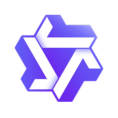
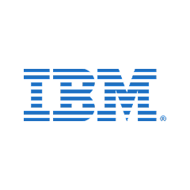
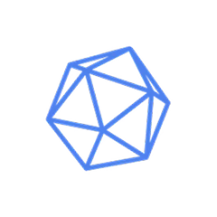

<div align="center">
  
  <p><strong>Portable AI — Run uncensored local LLMs natively on any device.</strong></p>
</div>

<br/>

Whyy Cloud is a comprehensive Flutter application that brings powerful, privacy-first local AI chat workflows directly to your mobile and desktop devices. Every chat, setting, and model remains exclusively on your device. The refined UI coordinates seamless model loading, parameter adjustments, transparent logs, and an integrated local API surface.

## Screenshots

<div align="center">
  
  
  
</div>

## Features

- **Local-First Execution:** 100% on-device inference using `llamadart` + `llama.cpp`. No internet required to chat.
- **Persistent Chat History:** Store and manage conversations securely using Hive local storage.
- **Over-The-Air (OTA) Models:** Download, manage, and run new models directly from the built-in library—no app updates required.
- **Granular AI Controls:** Tweak generation settings like `Temperature`, `System Prompts`, and hardware compute devices (CPU/Vulkan/OpenCL).
- **In-App Updater:** Automatically fetch the latest updates from the GitHub repository and install new APKs directly within the app.
- **Local API Server:** Expose your loaded model to your local network with an OpenAI-compatible API endpoint for easy integration with other tools.
- **Multimodal Support:** Voice inputs (Speech-to-Text), Text-to-Speech (TTS), and image/file attachments for vision models.
- **Customizable UI:** Full dark/light mode support, aesthetic glassmorphism, and dynamic component styling.
- **Deep Troubleshooting:** Built-in logs screen to monitor token generation speed, backend allocations, and diagnostic events.

## Top open-source models supported

Run the latest open-source AI models directly on your device. From conversational AI to advanced reasoning, choose from industry-leading models optimized for your Android Smartphone.

| Provider | Model Family | Description |
| :--- | :--- | :--- |
|  Meta | **Meta Llama** | Meta's flagship family of foundation models |
|  Google | **Google Gemma** | Google's lightweight, state-of-the-art models |
|  Hugging Face | **Hugging Face SmolLM** | Compact, efficient models by Hugging Face |
|  DeepSeek | **DeepSeek** | Advanced reasoning and coding models |
|  Qwen | **Qwen** | Alibaba's powerful multilingual models |
|  IBM | **IBM Granite** | IBM's open Granite models for enterprise AI |
|  Deep Cogito | **Deep Cogito** | Deep Cogito's reasoning-focused open models |
|  Liquid AI | **Liquid AI LFM** | Liquid AI's efficient Liquid Foundation Models |

## Getting Started

### Prerequisites

Ensure your Flutter environment is correctly set up.
For Android development on this machine, ensure these paths are available:
- `ANDROID_HOME=/Users/aditya/Library/Android/sdk`
- `JAVA_HOME=/Applications/Android Studio.app/Contents/jbr/Contents/Home`

### Build & Run

```bash
# Fetch dependencies
flutter pub get

# Run on the default connected device
flutter run

# Run on a specific emulator
flutter run -d emulator-5554

# Build a production-ready APK
flutter build apk --release
```

## License

Use is limited by the `LICENSE` file. You may study, fork, and improve the app for personal or educational use with attribution preserved, but you may not rebrand or present it as your own independent product.
